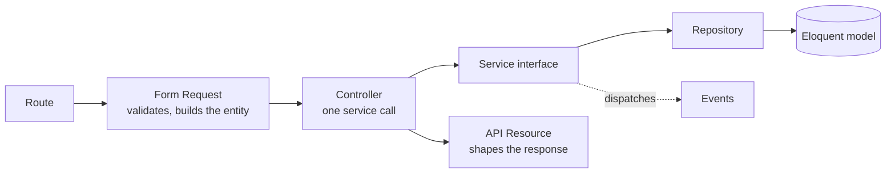

<div align="center">


**A production-grade Laravel 13 foundation: domain-driven structure, token authentication, a Filament
admin panel, and a coding canon that enforces itself.**

Clone it, name it, and start building your product, not your plumbing.


[Quick start](#-quick-start) ·
[Features](#-features) ·
[Architecture](#-architecture) ·
[Where it runs](#-where-it-runs) ·
[Standards](docs/standards/) ·
[Contributing](CONTRIBUTING.md)

</div>

---

This repository starts **deliberately empty of product**. What it ships is everything a serious
backend needs before its first feature: accounts and sessions, an admin panel, queues, logging,
infrastructure, a test suite, CI, and written standards that a machine checks on every pull request.

<table>
<tr>
<td width="33%" valign="top">
<h3>🔐 Auth, done</h3>
Registration, email verification, login, token refresh, password reset and account deletion,
all behind a dual Sanctum token pair.
</td>
<td width="33%" valign="top">
<h3>🧱 Domain modules</h3>
Business logic lives in self-contained domains with entities, services behind interfaces,
private repositories and their own docs.
</td>
<td width="33%" valign="top">
<h3>🛡️ Self-enforcing canon</h3>
Every rule a machine can check is checked by <code>php artisan canon:check</code>, and the build
fails on any single violation.
</td>
</tr>
<tr>
<td width="33%" valign="top">
<h3>🖥️ Filament 5 admin</h3>
An admin panel at <code>/admin</code> with roles and permissions, and a seeded Super Admin
who bypasses every gate.
</td>
<td width="33%" valign="top">
<h3>☁️ Runs anywhere</h3>
The same code runs on a laptop, a self-hosted server or AWS. Env picks every driver; no
backend is named in code.
</td>
<td width="33%" valign="top">
<h3>🤖 AI-ready</h3>
Subject-matter specialist agents, workflow skills and a Laravel Boost MCP server, all pointed at
the same written standards.
</td>
</tr>
</table>

## 🚀 Quick start

> [!NOTE]
> The only thing you need on your machine is **Docker**. PHP, Composer, PostgreSQL and nginx all run
> in containers.

```bash
cp .env.example .env
```

```bash
docker compose up -d --build
```

```bash
docker compose exec app bash
```

Then, inside the `app` container:

```bash
composer install
```

```bash
php artisan key:generate
```

```bash
php artisan migrate --seed
```

That's it:

| URL | What you'll find |
|---|---|
| http://localhost:8080 | The welcome page |
| http://localhost:8080/api/health | The health check, answering `{"status":"ok"}` |
| http://localhost:8080/admin | The admin panel. Sign in as `ADMIN_EMAIL`, whose local password is set in [`UserSeeder`](database/seeders/UserSeeder.php) |

> [!TIP]
> Change the port with `APP_PORT` in `.env`. On Fedora or another SELinux distribution, see the
> [Linux notes in `CONTRIBUTING.md`](CONTRIBUTING.md#linux-setup-rpm-based-distros-fedora-rhel-centos).

### Make it yours

1. **Name the application.** Change the vendor part of `name` in [`composer.json`](composer.json).
   That's the only place the name is written: config defaults, cookie and cache prefixes and AWS stack
   names all derive from it, and `APP_NAME` in `.env` overrides it at runtime
   ([PHP-22](docs/standards/php.md)).
2. **Brand it.** Set your colours and fonts in [`config/theme.php`](config/theme.php). The welcome
   page, the error pages, the emails and the admin panel all read them from there
   ([PHP-26](docs/standards/php.md), [how theming works](docs/infrastructure/theme.md)).
3. **Point emailed links at your frontend.** Set `ALLOWED_REDIRECT_ORIGINS` to the origins your
   password reset page and post-verification redirect live on.
4. **Write your welcome letter** in [`resources/views/welcome.blade.php`](resources/views/welcome.blade.php).
5. **Add your first domain.** Read [`domain-architecture.md`](docs/standards/domain-architecture.md),
   or ask the `domain-specialist` agent to scaffold one.
6. **Choose your drivers** for each environment. See [Where it runs](#-where-it-runs).

## ✨ Features

### 🔐 Authentication

A complete account lifecycle, documented rule by rule in the [Auth domain](app/Domains/Auth/README.md).

- **Dual token sessions.** A short-lived access token for API calls and a longer-lived refresh token
  whose only power is to mint a new pair. "Remember me" is chosen at login and kept across refreshes.
- **Email verification** through signed, time-limited links, with an optional redirect to your frontend.
- **Password reset** that signs the user out everywhere by revoking every token they hold.
- **Two-phase account deletion.** The account is locked out immediately, then a queued job removes it
  and retries up to five times. A persistent failure lands in `failed_jobs` with its real cause.
- **No account enumeration.** Login and password reset never reveal whether an email has an account.
- **Safe emailed links.** Links only point at an origin you allow, and emails are unique regardless
  of letter case.

| Method | Endpoint | Called with |
|---|---|---|
| `POST` | `/api/auth/register` | nothing (guest) |
| `POST` | `/api/auth/login` | nothing (guest) |
| `POST` | `/api/auth/forgot_password` | nothing (guest) |
| `POST` | `/api/auth/reset_password` | nothing (guest) |
| `POST` | `/api/auth/refresh_token` | the refresh token |
| `POST` | `/api/auth/logout` | an access token |
| `POST` | `/api/auth/send_verification_email` | an access token |
| `DELETE` | `/api/auth/delete_account` | an access token |
| `GET` | `/verify/{userId}/{hash}` | the signed link from the verification email |
| `GET` | `/api/health` | nothing |

Guest routes are throttled to 20 requests a minute. A new authenticated route goes in the
`authenticated` middleware group, which admits access tokens only.

### 🖥️ Admin panel

- **Filament 5 on Livewire 4**, served at `/admin`, with a dashboard ready for your widgets.
- **Roles and permissions** through Spatie Permission, with view, create, update and delete
  permissions seeded for users, roles and permissions.
- **Guarded front door.** Entering takes a verified email and at least one role.
- **Super Admin** bypasses every authorization check in the application, and the seeder grants it to
  `ADMIN_EMAIL`.

### ⚙️ Infrastructure built in

- **Four priority queues:** `high`, `default`, `default-ordered` and `low`, with an SQS FIFO connector
  so ordered jobs really keep their order in production.
- **CloudWatch log driver** that ships batched logs straight to a log group.
- **Read/write database split.** Plain reads go to the Aurora reader endpoint, and writes,
  transactions and locking reads go to the writer. With a single database, leave `DB_READ_HOST`
  empty.
- **AWS CDK stacks** in TypeScript: SQS queues with a dead-letter queue, a log group, an S3 bucket and a
  DynamoDB cache table in `main`, and an Aurora PostgreSQL cluster in `database`.
- **One theme everywhere.** Colours and fonts live in `config/theme.php`, and the welcome page, the
  error pages, the emails and the admin panel all derive from it. `canon:check` fails on a colour
  written anywhere else.
- **Branded emails** for verification, password reset and account deletion, translated into seven
  languages. Signed-in requests run in the user's preferred language.
- **Custom error pages** for 400, 401, 403, 404, 419, 429, 500 and 503.

### 🛡️ Quality gates

| Layer | Owns | Command |
|---|---|---|
| **PHP-CS-Fixer** | Formatting. Auto-fixes, so nobody reviews it by hand. | `composer lint:fix` |
| **PHP Insights** | Aggregate quality: typing, complexity, architecture. Thresholds only ratchet upward. | `composer insights` |
| **Canon check** | Every mechanical rule in `docs/standards/`, one violation at a time. | `php artisan canon:check` |
| **PHPUnit 12** | Unit and feature suites against a real PostgreSQL. | `composer test` |

CI runs all of them on every pull request in parallel, along with a branch-name check and a
`composer audit` for dependency advisories. The pipeline ships as a GitHub Actions workflow,
[`.github/workflows/ci.yml`](.github/workflows/ci.yml).

## 🧭 Architecture

Business logic lives in **domains** under `app/Domains/`. Each one is a self-contained module that
other code reaches only through its public surface: entities, service interfaces and events.

```text
app/Domains/Auth/
├── README.md        what the domain does, in plain language
├── Docs/            its business rules, with worked examples
├── Entities/        User, UserId, TokenPair: typed data, never arrays
├── Events/          UserRegistered, UserDeleted
├── Http/            Controllers · Requests · Resources
├── Providers/       binds every interface explicitly
├── Repositories/    injected only into this domain's own services
├── Services/        AccountServiceInterface, AuthServiceInterface
└── …                Enums, Exceptions, Listeners, Mail, Notifications, Rules
```

Every request takes the same path through a domain:



The domains you start with:

| Domain | Holds |
|---|---|
| **Core** | Foundational types every domain builds on, such as the base class for typed entity IDs |
| **Auth** | Accounts, sessions, verification, password reset, deletion, and who may enter the admin panel |

<details>
<summary><b>The rest of the repository</b></summary>

```text
app/
├── Domains/          domain modules
├── Filament/         the admin panel
├── Http/             shared HTTP layer: kernel, middleware, the health check
├── Logging/          the CloudWatch log driver
├── Policies/Admin/   who may manage users, roles and permissions
└── Queue/            the SQS FIFO connector for ordered jobs
cloud/aws/            AWS CDK infrastructure
docker/               the PHP, nginx and PostgreSQL images
docs/
├── standards/        the coding canon, the single authority
└── infrastructure/   how configuration, drivers and framework overrides work
insights/             the checks behind canon:check
lang/                 translations
tests/                Unit and Feature suites
.claude/              AI specialist agents, skills and hooks
```

</details>

## 🌍 Where it runs

The same code runs on a laptop, a self-hosted server and AWS. Env is the only difference: no backend
is named in code ([PHP-23](docs/standards/php.md)).

| Service | Local default | Self-hosted | AWS | Switched by |
|---|---|---|---|---|
| Database | Postgres (compose) | Postgres | Aurora Postgres | `DB_*`, `DB_READ_HOST` |
| Queues | `sync` | `database` or `redis` | `sqs` | `QUEUE_DRIVER` |
| Cache | `database` | `database` or `redis` | `dynamodb` | `CACHE_STORE`, `DYNAMODB_CACHE_TABLE` |
| Sessions | `database` | `database` or `redis` | `database` | `SESSION_DRIVER` |
| Files | local disk | local disk or any S3-compatible bucket | S3 | `FILESYSTEM_DISK`, `AWS_BUCKET`, `AWS_ENDPOINT` |
| Logs | `single` | `stderr` | `stderr,cloud` | `LOG_STACK` |
| Mail | `log` | `smtp` | `ses` | `MAIL_MAILER` |

Moving files from the local disk to a bucket, for example, means setting `FILESYSTEM_DISK=s3` and
filling in the `AWS_*` bucket variables. Nothing else changes.

<details>
<summary><b>Queue workers</b></summary>

<br>

Jobs run inline locally (`QUEUE_DRIVER=sync`), so there is no worker to start. To try real queueing,
set `QUEUE_DRIVER=database` and start the worker and the scheduler:

```bash
docker compose --profile workers up -d
```

On `database` or `redis` the four queue connections share one store, so a single worker serves them
all, highest priority first:

```bash
php artisan queue:work default --queue=high,default,default-ordered,low
```

On `sqs` each connection is its own queue, so run one worker per connection (`queue:work high`,
`queue:work low`, and so on). Jobs on `default-ordered` keep their order on SQS FIFO. Elsewhere they
keep it only while a single worker consumes that queue.

</details>

<details>
<summary><b>Self-hosting</b></summary>

<br>

[`compose.production.yml`](compose.production.yml) runs the production images: the app, the web
server, a queue worker and the scheduler. PostgreSQL is included under the `database` profile if you
don't bring your own.

Copy the env file, then set `APP_KEY`, `APP_ENV=production`, `APP_DEBUG=false`, `DB_*` and the drivers:

```bash
cp .env.example .env
```

```bash
docker compose -f compose.production.yml --profile database up -d --build
```

```bash
docker compose -f compose.production.yml exec app php artisan migrate --force --isolated
```

</details>

<details>
<summary><b>AWS</b></summary>

<br>

The infrastructure is declared with AWS CDK in [`cloud/aws/`](cloud/aws/). One stage per environment,
each with two stacks:

| Stack | Resources |
|---|---|
| `main` | SQS queues (`default`, `high`, `low`, `default-ordered.fifo` with its dead-letter queue), the log group, the `files` S3 bucket and the `cache` DynamoDB table |
| `database` | Aurora PostgreSQL cluster, its security groups, and the generated credentials secret |

Profiles, commands and the stack outputs to copy into `.env` are in
[`cloud/aws/README.md`](cloud/aws/README.md).

</details>

## 🧰 Everyday commands

> [!IMPORTANT]
> Commands run **inside the `app` container**. Open a shell there with `docker compose exec app bash`.

| Command | Does |
|---|---|
| `composer test` | Runs the test suite |
| `composer test:coverage` | Runs it with coverage, written to `coverage/html` and `coverage/xml` |
| `./vendor/bin/phpunit --filter SomeTest` | Runs one test class or method |
| `composer lint:fix` | Fixes code style |
| `composer lint:check` | Checks code style without changing anything |
| `composer insights` | Scores aggregate code quality |
| `php artisan canon:check` | Lists every mechanical rule and fails on any violation |
| `php artisan migrate --seed` | Migrates and seeds roles, permissions and the Super Admin |

## 📐 Standards

[`docs/standards/`](docs/standards/) is the single authority on how code is written here, for people
and AI assistants alike. Every rule has a permanent ID (`DA-03`, `ENT-02`, `HTTP-12`), so a review
comment is a lookup rather than an argument.

| File | Covers |
|---|---|
| [`php.md`](docs/standards/php.md) | Types, naming and class suffixes, PHPDoc, comments |
| [`domain-architecture.md`](docs/standards/domain-architecture.md) | Domain structure, the public surface, services |
| [`entities.md`](docs/standards/entities.md) | Entity design, `store` / `get` / `delete` semantics |
| [`http.md`](docs/standards/http.md) | Controllers, Form Requests, API Resources, routes, exceptions |
| [`persistence.md`](docs/standards/persistence.md) | Models, repositories, migrations, factories |
| [`testing.md`](docs/standards/testing.md) | Test conventions |
| [`git.md`](docs/standards/git.md) | Branching, commits, pull requests |
| [`tasks.md`](docs/standards/tasks.md) | Writing tasks for the tracker |

Start with the [index and its non-negotiables](docs/standards/README.md). It also explains how to
change a rule you think is wrong.

## 🤖 Working with AI assistants

Everything in [`.claude/`](.claude/) is committed, so a fresh clone opened in Claude Code comes fully
equipped. [`CLAUDE.md`](CLAUDE.md) routes the assistant to the right standard before it writes a line.

<table>
<tr>
<th>Specialist agents</th>
<th>Skills</th>
</tr>
<tr>
<td valign="top">

- `http-specialist`: endpoints, Form Requests, Resources
- `domain-specialist`: domain modules and services
- `database-specialist`: migrations, models, queries
- `filament-specialist`: the admin panel
- `test-specialist`: writing, auditing and fixing tests
- `docker-specialist`: the container setup
- `task-specialist`: breaking work down into tickets
- `code-standards-specialist`: reviewing PHP against the canon

</td>
<td valign="top">

- `/ship`: takes a ticket from intake to release
- `/audit`: reviews a branch, domain or path against the standards
- `/create-task`: publishes a task breakdown to Jira
- `/review-pr`: reviews a pull request
- `/handoff`: saves progress for the next session
- `coding-standards`: loads the canon into a session

</td>
</tr>
</table>

A **Laravel Boost** MCP server runs through Docker for version-accurate docs, schema inspection and
Tinker. A hook also reminds the assistant to run a standards review whenever a turn changes PHP. The
rules for AI-assisted work are in [`CONTRIBUTING.md`](CONTRIBUTING.md#working-with-ai-assistants).

## 🤝 Contributing

Setup details, branch naming, the review flow and the house rules are in
[`CONTRIBUTING.md`](CONTRIBUTING.md). In short: branch off `main` as `feat/<KEY>-<slug>`,
`fix/<KEY>-<slug>`, `chore/<slug>` or `refactor/<slug>`, keep CI green, and bring what you touch up
to standard.

## 📄 License

Released under the [MIT license](LICENSE).
